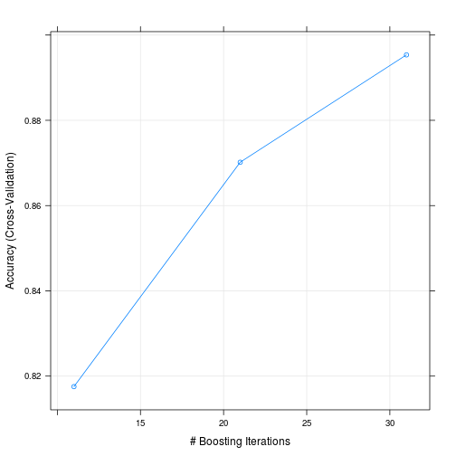
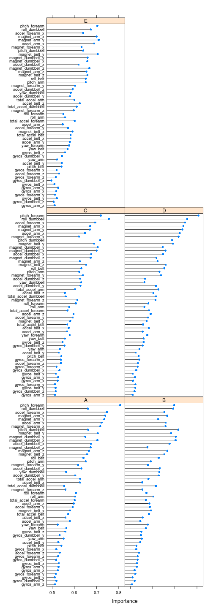

## Setup

First, let's setup some global options for knitting this project:

```r
# Set globals:
require(knitr)
options(width = 70)
# opts_chunk$set(
#   echo = TRUE,
#   message = FALSE,
#   warning = FALSE,
#   error = FALSE,
#   comment = NA, 
#   cache = TRUE, 
#   dev = 'pdf'
#   )
```

I like to start with a completely fresh environment. Let's remove anything from the last R session:

```r
# Delete leftovers from last session:
rm(list = ls())
```

Set a random seed to assure reproducibility of the results:

```r
# Set random seed:
set.seed(42)
# This will guarantee reproducability of the results
```

## Tools

Install a bunch of libraries that we'll need later:

```r
if(!require(caret)) {
  install.packages("caret")
  }
library(caret)

if(!require(rpart)) {
  install.packages("rpart")
  }
library(rpart)

if(!require(randomForest)) {
  install.packages("randomForest")
  }
library(randomForest)

if(!require(caTools)) {
  install.packages("caTools")
  }
library(caTools)

if(!require(e1071)) {
  install.packages("e1071")
}
library(e1071)

if(!require(kernlab)) {
  install.packages("kernlab")
}
library(kernlab)

if(!require(doParallel)) {
  install.packages("doParallel")
}
library(doParallel)

if(!require(pROC)) {
  install.packages("pROC")
}
library(pROC)
```

## Data preparation

Check if we already downloaded the data from the web. If the files don't exist in the session working directory, download them:

```r
# Download training data:
  training.file <- "pml-training.csv"
if(!file.exists(training.file)) { 
  URL1 <- "https://d396qusza40orc.cloudfront.net/predmachlearn/pml-training.csv"
  download.file(URL1, training.file, method="curl")
}

# Download testing data:
testing.file <- "pml-testing.csv"
if(!file.exists(testing.file)) { 
  URL2 <- "https://d396qusza40orc.cloudfront.net/predmachlearn/pml-testing.csv"
  download.file(URL2, testing.file, method="curl")
}
```

From inspecting the files previously, we know that the first column contains the row names. We'll tell read.csv that. Also, we noticed that there are a bunch of "#DIV/0!" entries the denote a division by zero error; we'll treat those values as NA's: 

```r
# We're going to replace the #DIV/0! entries with NA
training <- read.csv(training.file, row.names=1, na.strings=c("NA", "#DIV/0!"))
testing <- read.csv(testing.file, row.names=1, na.strings=c("NA", "#DIV/0!"))
```

### Data cleaning

The data is segmented into a number of blocks of data called "windows". The "new_window" variable indicates the start of a new window. These windows are indexed by the "num_window" variable. Using the data in each window, a number of statistics appear to have been calculated: mean, min, max, standard deviation, skewness, kurtosis, and so on. Their values are contained in separate columns in the rows for which the "new_window" variable (indicating the start of a new data block) is equal to "yes". The remaining rows in these columns are NA's. We'll drop these columns, thereby removing all the NA's:  

```r
na.data <- sapply(training, function(x) sum(is.na(x)) > 0)
names(na.data) <- colnames(training)
print("Dropping these columns:")
```

```
## [1] "Dropping these columns:"
```

```r
print(names(training[na.data]))
```

```
##   [1] "kurtosis_roll_belt"       "kurtosis_picth_belt"     
##   [3] "kurtosis_yaw_belt"        "skewness_roll_belt"      
##   [5] "skewness_roll_belt.1"     "skewness_yaw_belt"       
##   [7] "max_roll_belt"            "max_picth_belt"          
##   [9] "max_yaw_belt"             "min_roll_belt"           
##  [11] "min_pitch_belt"           "min_yaw_belt"            
##  [13] "amplitude_roll_belt"      "amplitude_pitch_belt"    
##  [15] "amplitude_yaw_belt"       "var_total_accel_belt"    
##  [17] "avg_roll_belt"            "stddev_roll_belt"        
##  [19] "var_roll_belt"            "avg_pitch_belt"          
##  [21] "stddev_pitch_belt"        "var_pitch_belt"          
##  [23] "avg_yaw_belt"             "stddev_yaw_belt"         
##  [25] "var_yaw_belt"             "var_accel_arm"           
##  [27] "avg_roll_arm"             "stddev_roll_arm"         
##  [29] "var_roll_arm"             "avg_pitch_arm"           
##  [31] "stddev_pitch_arm"         "var_pitch_arm"           
##  [33] "avg_yaw_arm"              "stddev_yaw_arm"          
##  [35] "var_yaw_arm"              "kurtosis_roll_arm"       
##  [37] "kurtosis_picth_arm"       "kurtosis_yaw_arm"        
##  [39] "skewness_roll_arm"        "skewness_pitch_arm"      
##  [41] "skewness_yaw_arm"         "max_roll_arm"            
##  [43] "max_picth_arm"            "max_yaw_arm"             
##  [45] "min_roll_arm"             "min_pitch_arm"           
##  [47] "min_yaw_arm"              "amplitude_roll_arm"      
##  [49] "amplitude_pitch_arm"      "amplitude_yaw_arm"       
##  [51] "kurtosis_roll_dumbbell"   "kurtosis_picth_dumbbell" 
##  [53] "kurtosis_yaw_dumbbell"    "skewness_roll_dumbbell"  
##  [55] "skewness_pitch_dumbbell"  "skewness_yaw_dumbbell"   
##  [57] "max_roll_dumbbell"        "max_picth_dumbbell"      
##  [59] "max_yaw_dumbbell"         "min_roll_dumbbell"       
##  [61] "min_pitch_dumbbell"       "min_yaw_dumbbell"        
##  [63] "amplitude_roll_dumbbell"  "amplitude_pitch_dumbbell"
##  [65] "amplitude_yaw_dumbbell"   "var_accel_dumbbell"      
##  [67] "avg_roll_dumbbell"        "stddev_roll_dumbbell"    
##  [69] "var_roll_dumbbell"        "avg_pitch_dumbbell"      
##  [71] "stddev_pitch_dumbbell"    "var_pitch_dumbbell"      
##  [73] "avg_yaw_dumbbell"         "stddev_yaw_dumbbell"     
##  [75] "var_yaw_dumbbell"         "kurtosis_roll_forearm"   
##  [77] "kurtosis_picth_forearm"   "kurtosis_yaw_forearm"    
##  [79] "skewness_roll_forearm"    "skewness_pitch_forearm"  
##  [81] "skewness_yaw_forearm"     "max_roll_forearm"        
##  [83] "max_picth_forearm"        "max_yaw_forearm"         
##  [85] "min_roll_forearm"         "min_pitch_forearm"       
##  [87] "min_yaw_forearm"          "amplitude_roll_forearm"  
##  [89] "amplitude_pitch_forearm"  "amplitude_yaw_forearm"   
##  [91] "var_accel_forearm"        "avg_roll_forearm"        
##  [93] "stddev_roll_forearm"      "var_roll_forearm"        
##  [95] "avg_pitch_forearm"        "stddev_pitch_forearm"    
##  [97] "var_pitch_forearm"        "avg_yaw_forearm"         
##  [99] "stddev_yaw_forearm"       "var_yaw_forearm"
```

```r
training <- training[!na.data]
```

The first six columns contain data that are unlikely to have any predictive value; they include the name of the test subject, time-stamps, and so on. We remove these columns:

```r
training <- training[,7:ncol(training)]
print(names(training))
```

```
##  [1] "roll_belt"            "pitch_belt"          
##  [3] "yaw_belt"             "total_accel_belt"    
##  [5] "gyros_belt_x"         "gyros_belt_y"        
##  [7] "gyros_belt_z"         "accel_belt_x"        
##  [9] "accel_belt_y"         "accel_belt_z"        
## [11] "magnet_belt_x"        "magnet_belt_y"       
## [13] "magnet_belt_z"        "roll_arm"            
## [15] "pitch_arm"            "yaw_arm"             
## [17] "total_accel_arm"      "gyros_arm_x"         
## [19] "gyros_arm_y"          "gyros_arm_z"         
## [21] "accel_arm_x"          "accel_arm_y"         
## [23] "accel_arm_z"          "magnet_arm_x"        
## [25] "magnet_arm_y"         "magnet_arm_z"        
## [27] "roll_dumbbell"        "pitch_dumbbell"      
## [29] "yaw_dumbbell"         "total_accel_dumbbell"
## [31] "gyros_dumbbell_x"     "gyros_dumbbell_y"    
## [33] "gyros_dumbbell_z"     "accel_dumbbell_x"    
## [35] "accel_dumbbell_y"     "accel_dumbbell_z"    
## [37] "magnet_dumbbell_x"    "magnet_dumbbell_y"   
## [39] "magnet_dumbbell_z"    "roll_forearm"        
## [41] "pitch_forearm"        "yaw_forearm"         
## [43] "total_accel_forearm"  "gyros_forearm_x"     
## [45] "gyros_forearm_y"      "gyros_forearm_z"     
## [47] "accel_forearm_x"      "accel_forearm_y"     
## [49] "accel_forearm_z"      "magnet_forearm_x"    
## [51] "magnet_forearm_y"     "magnet_forearm_z"    
## [53] "classe"
```

```r
# # For testing only (use less data for quick tests):
# inTrain <- createDataPartition(y=training$classe,p=0.1,list=FALSE)
# training <- training[inTrain,]
```

Features with near zero variance are unlikely to be useful. Let's check if any exist, and then remove them:

```r
nzv <- nearZeroVar(training, saveMetrics=TRUE)
# We remove these:
nzv.to.remove <- names(training[, nzv$nzv])
training <- training[, !nzv$nzv]
```

This proceedure removes 0 columns from the data. We are left with tidy data that we can use to build a model.

Next, we partition the data into a training set and a cross-validation set:

```r
inTrain <- createDataPartition(y=training$classe,p=0.75,list=FALSE)
training <- training[inTrain,]
cv <- training[-inTrain,]
```

### Data preprocessing

Next, it may be useful to apply mean normalisation and feature scaling to the data so that the features are commensurate. Additionally, we'll also apply a Yeo-Johnson transform so that the features' distributions are more Gaussian-like. The Yeo-Johnson transform is similar to the Box-Cox transform discussed in class, but does not have the constraint that the predictor values must be strictly positive:

```r
# The final column is the response; don't transform that:
normalization <- preProcess(training[-ncol(training)],
                            c("YeoJohnson","center","scale"))
normalization
```

```
## 
## Call:
## preProcess.default(x = training[-ncol(training)], method
##  = c("YeoJohnson", "center", "scale"))
## 
## Created from 14718 samples and 52 variables
## Pre-processing: Yeo-Johnson transformation, centered, scaled 
## 
## Lambda estimates for Yeo-Johnson transformation:
##    Min. 1st Qu.  Median    Mean 3rd Qu.    Max. 
##  0.1854  0.8700  0.9974  1.0970  1.0760  8.3190
```


```r
training[-ncol(training)] <- predict(normalization, training[-ncol(training)])
# summary(training)
```

## Training

R can be a bit slow. Let's speed things up a bit by using all the available cores on our machine:


```r
cl <- makeCluster(detectCores())
registerDoParallel(cl)
ncores <- getDoParWorkers()
```

On this machine, we have 2 available cores.


```r
k <- 10
reps <- 3
ctrl <- trainControl(method="cv", number=k, repeats=reps)
# print(ctrl)
```

We'll train our model using repeated k-fold cross validation with 10 folds and 3 repeats; that should help prevent overfitting. Out-of-bag (OOB) error estimates and error rates for each of the classes are printed during training.


```r
# The train S3 method is a little faster than the S4 method for large data:
ydata = training$classe
xdata = subset(training, select = -classe)
```

### Model


```r
model <- train(y = ydata, x = xdata, method="LogitBoost", trControl=ctrl, do.trace=TRUE)

print(model)
```

```
## Boosted Logistic Regression 
## 
## 14718 samples
##    52 predictors
##     5 classes: 'A', 'B', 'C', 'D', 'E' 
## 
## No pre-processing
## Resampling: Cross-Validated (10 fold) 
## 
## Summary of sample sizes: 13247, 13245, 13247, 13247, 13245, 13247, ... 
## 
## Resampling results across tuning parameters:
## 
##   nIter  Accuracy   Kappa      Accuracy SD  Kappa SD   
##   11     0.8175399  0.7667372  0.015469672  0.019423627
##   21     0.8701675  0.8338012  0.006461888  0.008723946
##   31     0.8953522  0.8669331  0.009681329  0.012036870
## 
## Accuracy was used to select the optimal model using  the
##  largest value.
## The final value used for the model was nIter = 31.
```

```r
plot(model)
```

 

**We used LogitBoost as classifier. The chief reason for this choice is my computer is old and slow, and even with tricks and speed-ups it would take until the end of time itself for my machine to train a more complex model. It is not possible for me to rent CPU time on a cloud or cluster; this is too expensive for me. Ensembling or model stacking is out of the question. A secondary consideration is the ability of the model to do multi-class classification. The set of classifiers to choose from that satisfy these criteria is quite small.** 

### Performance evaluated on the training data

We'll evaluate the accuracy of the model on the training set. This will underestimate the out of sample error, but will tell us if the model is likely to perform badly on new data: if the accuracy of the model estimated on the training set is low, we may want to consider other models.

```r
ypred <- predict(model, training)

train.results <- confusionMatrix(ypred, ydata)
print(train.results)
```

```
## Confusion Matrix and Statistics
## 
##           Reference
## Prediction    A    B    C    D    E
##          A 3565  163   44   36   11
##          B   70 1977  115    9   56
##          C   26   95 1792  141   46
##          D   40   48   93 1712   49
##          E   48   29   22   82 2271
## 
## Overall Statistics
##                                           
##                Accuracy : 0.9025          
##                  95% CI : (0.8971, 0.9076)
##     No Information Rate : 0.299           
##     P-Value [Acc > NIR] : < 2.2e-16       
##                                           
##                   Kappa : 0.876           
##  Mcnemar's Test P-Value : < 2.2e-16       
## 
## Statistics by Class:
## 
##                      Class: A Class: B Class: C Class: D Class: E
## Sensitivity            0.9509   0.8551   0.8674   0.8646   0.9334
## Specificity            0.9711   0.9756   0.9706   0.9782   0.9821
## Pos Pred Value         0.9335   0.8877   0.8533   0.8816   0.9262
## Neg Pred Value         0.9789   0.9675   0.9738   0.9747   0.9839
## Prevalence             0.2990   0.1844   0.1648   0.1579   0.1940
## Detection Rate         0.2843   0.1577   0.1429   0.1365   0.1811
## Detection Prevalence   0.3045   0.1776   0.1675   0.1549   0.1955
## Balanced Accuracy      0.9610   0.9153   0.9190   0.9214   0.9578
```

Next, we'll examine the importance of the variables used in building the model, and print the predictors that are used in the final model:

```r
importance <- varImp(model, scale = FALSE)
print(importance)
```

```
## ROC curve variable importance
## 
##   variables are sorted by maximum importance across the classes
##   only 20 most important variables shown (out of 52)
## 
##                        A      B      C      D      E
## pitch_forearm     0.8061 0.6974 0.7195 0.8061 0.7036
## roll_dumbbell     0.6610 0.6927 0.7559 0.7559 0.6747
## accel_forearm_x   0.7468 0.6534 0.6941 0.7468 0.6397
## magnet_arm_x      0.7385 0.6656 0.6709 0.7385 0.7001
## magnet_arm_y      0.7347 0.6253 0.6701 0.7347 0.7097
## accel_arm_x       0.7227 0.6591 0.6477 0.7227 0.6894
## magnet_forearm_x  0.7167 0.6583 0.6204 0.7167 0.6328
## pitch_dumbbell    0.6616 0.7159 0.7159 0.6879 0.6392
## magnet_belt_y     0.7054 0.6834 0.6891 0.6911 0.7054
## magnet_dumbbell_y 0.6490 0.7053 0.7053 0.6458 0.6595
## magnet_dumbbell_x 0.7039 0.7039 0.7009 0.6579 0.6585
## accel_dumbbell_x  0.6747 0.6765 0.6765 0.6473 0.6190
## magnet_dumbbell_z 0.6735 0.5770 0.6735 0.6169 0.6679
## magnet_arm_z      0.6661 0.6661 0.6251 0.6225 0.6540
## magnet_belt_z     0.6579 0.6531 0.6537 0.6590 0.6590
## roll_belt         0.6411 0.6275 0.6316 0.6524 0.6524
## pitch_arm         0.6517 0.5919 0.6217 0.6307 0.6517
## magnet_forearm_y  0.6171 0.5789 0.6376 0.6376 0.6036
## accel_dumbbell_z  0.6321 0.6321 0.6260 0.5665 0.5925
## yaw_dumbbell      0.5631 0.6301 0.6301 0.5633 0.5848
```

```r
plot(importance)
```

 

```r
predictors(model)
```

```
##  [1] "pitch_forearm"        "roll_forearm"        
##  [3] "magnet_dumbbell_z"    "magnet_dumbbell_y"   
##  [5] "yaw_belt"             "total_accel_forearm" 
##  [7] "magnet_arm_z"         "accel_dumbbell_y"    
##  [9] "accel_forearm_z"      "magnet_belt_x"       
## [11] "roll_belt"            "total_accel_dumbbell"
## [13] "magnet_forearm_z"     "yaw_arm"             
## [15] "roll_arm"
```

### Cross validation

To evaluate the ability of the model to generalise to data not seen during training, we need to test the model on the hold-out cross validation data. But first, we need to preprocess the data using the same parameters that were learned on the training data:

```r
cv[-ncol(cv)] <- predict(normalization, cv[-ncol(cv)])
# summary(training)
```

Now that the data has been transformed, we can predict the response variable and compare the results with the ground truth class labels. A contingency table, or "confusion matrix", allows us to examine the performance of the model and estimate the out of sample error:

```r
ydata = cv$classe
xdata = subset(cv, select = -classe)

ypred <- predict(model, cv)

cv.results <- confusionMatrix(ypred, ydata)
print(cv.results)
```

```
## Confusion Matrix and Statistics
## 
##           Reference
## Prediction   A   B   C   D   E
##          A 892  37  17   8   1
##          B  24 505  35   3   9
##          C   7  24 447  34  15
##          D  10  12  19 434  13
##          E   8   3   2  17 548
## 
## Overall Statistics
##                                           
##                Accuracy : 0.9046          
##                  95% CI : (0.8938, 0.9147)
##     No Information Rate : 0.3012          
##     P-Value [Acc > NIR] : < 2.2e-16       
##                                           
##                   Kappa : 0.8786          
##  Mcnemar's Test P-Value : 4.154e-05       
## 
## Statistics by Class:
## 
##                      Class: A Class: B Class: C Class: D Class: E
## Sensitivity            0.9479   0.8692   0.8596   0.8750   0.9352
## Specificity            0.9711   0.9721   0.9693   0.9795   0.9882
## Pos Pred Value         0.9340   0.8767   0.8482   0.8893   0.9481
## Neg Pred Value         0.9774   0.9702   0.9719   0.9765   0.9851
## Prevalence             0.3012   0.1860   0.1665   0.1588   0.1876
## Detection Rate         0.2855   0.1617   0.1431   0.1389   0.1754
## Detection Prevalence   0.3057   0.1844   0.1687   0.1562   0.1850
## Balanced Accuracy      0.9595   0.9206   0.9144   0.9272   0.9617
```

The out of sample error is estimated to be $100\times(1-accuracy) =$ 9.5390525%.

## Testing

Now that we're reasonably confident that the model will accurately predict the response variable, we shall predict on the test data. We'll process the data in an identical fashion to the training data:

```r
# Remove the columns that we previously identified in the training data:
print("Dropping these columns:")
```

```
## [1] "Dropping these columns:"
```

```r
print(names(testing[na.data]))
```

```
##   [1] "kurtosis_roll_belt"       "kurtosis_picth_belt"     
##   [3] "kurtosis_yaw_belt"        "skewness_roll_belt"      
##   [5] "skewness_roll_belt.1"     "skewness_yaw_belt"       
##   [7] "max_roll_belt"            "max_picth_belt"          
##   [9] "max_yaw_belt"             "min_roll_belt"           
##  [11] "min_pitch_belt"           "min_yaw_belt"            
##  [13] "amplitude_roll_belt"      "amplitude_pitch_belt"    
##  [15] "amplitude_yaw_belt"       "var_total_accel_belt"    
##  [17] "avg_roll_belt"            "stddev_roll_belt"        
##  [19] "var_roll_belt"            "avg_pitch_belt"          
##  [21] "stddev_pitch_belt"        "var_pitch_belt"          
##  [23] "avg_yaw_belt"             "stddev_yaw_belt"         
##  [25] "var_yaw_belt"             "var_accel_arm"           
##  [27] "avg_roll_arm"             "stddev_roll_arm"         
##  [29] "var_roll_arm"             "avg_pitch_arm"           
##  [31] "stddev_pitch_arm"         "var_pitch_arm"           
##  [33] "avg_yaw_arm"              "stddev_yaw_arm"          
##  [35] "var_yaw_arm"              "kurtosis_roll_arm"       
##  [37] "kurtosis_picth_arm"       "kurtosis_yaw_arm"        
##  [39] "skewness_roll_arm"        "skewness_pitch_arm"      
##  [41] "skewness_yaw_arm"         "max_roll_arm"            
##  [43] "max_picth_arm"            "max_yaw_arm"             
##  [45] "min_roll_arm"             "min_pitch_arm"           
##  [47] "min_yaw_arm"              "amplitude_roll_arm"      
##  [49] "amplitude_pitch_arm"      "amplitude_yaw_arm"       
##  [51] "kurtosis_roll_dumbbell"   "kurtosis_picth_dumbbell" 
##  [53] "kurtosis_yaw_dumbbell"    "skewness_roll_dumbbell"  
##  [55] "skewness_pitch_dumbbell"  "skewness_yaw_dumbbell"   
##  [57] "max_roll_dumbbell"        "max_picth_dumbbell"      
##  [59] "max_yaw_dumbbell"         "min_roll_dumbbell"       
##  [61] "min_pitch_dumbbell"       "min_yaw_dumbbell"        
##  [63] "amplitude_roll_dumbbell"  "amplitude_pitch_dumbbell"
##  [65] "amplitude_yaw_dumbbell"   "var_accel_dumbbell"      
##  [67] "avg_roll_dumbbell"        "stddev_roll_dumbbell"    
##  [69] "var_roll_dumbbell"        "avg_pitch_dumbbell"      
##  [71] "stddev_pitch_dumbbell"    "var_pitch_dumbbell"      
##  [73] "avg_yaw_dumbbell"         "stddev_yaw_dumbbell"     
##  [75] "var_yaw_dumbbell"         "kurtosis_roll_forearm"   
##  [77] "kurtosis_picth_forearm"   "kurtosis_yaw_forearm"    
##  [79] "skewness_roll_forearm"    "skewness_pitch_forearm"  
##  [81] "skewness_yaw_forearm"     "max_roll_forearm"        
##  [83] "max_picth_forearm"        "max_yaw_forearm"         
##  [85] "min_roll_forearm"         "min_pitch_forearm"       
##  [87] "min_yaw_forearm"          "amplitude_roll_forearm"  
##  [89] "amplitude_pitch_forearm"  "amplitude_yaw_forearm"   
##  [91] "var_accel_forearm"        "avg_roll_forearm"        
##  [93] "stddev_roll_forearm"      "var_roll_forearm"        
##  [95] "avg_pitch_forearm"        "stddev_pitch_forearm"    
##  [97] "var_pitch_forearm"        "avg_yaw_forearm"         
##  [99] "stddev_yaw_forearm"       "var_yaw_forearm"
```

```r
testing <- testing[!na.data]
# Remove the first six columns that contain data not useful for prediction:
testing <- testing[,7:ncol(testing)]
# Remove columns with near zero variation identified in the training set:
training <- training[, !nzv$nzv]
```

We preprocess the test data using the parameters that were learned on the training data:

```r
testing[-ncol(testing)] <- predict(normalization, testing[-ncol(testing)])
```

The final column in the test data isn't useful, so we drop it. We then use the trained model to predict the test set response variable:

```r
testing = subset(testing, select = -problem_id)

answers <- predict(model, testing)
```

### Wrap-up

Finally, we'll create the text files to submit to Coursera. Each file corresponds to the prediction for the corresponding problem in the test data set.

```r
pml_write_files = function(x){
  n = length(x)
  for(i in 1:n){
    filename = paste0("problem_id_",i,".txt")
    write.table(x[i],file=filename,quote=FALSE,row.names=FALSE,col.names=FALSE)
  }
}
pml_write_files(answers)
```

It is good practice to shut down the workers by calling stopCluster:

```r
stopCluster(cl)
```
